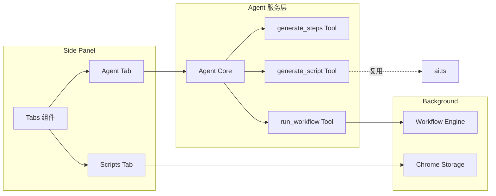
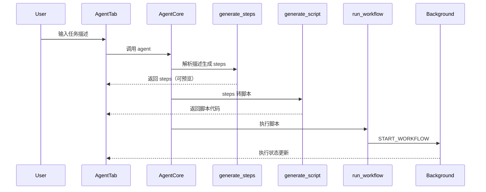

# Side Panel Agent 模式重构

## 架构概览




## 1. 安装依赖

```bash
npm install ai @ai-sdk/openai
```

Vercel AI SDK 通过 OpenAI-compatible provider 支持 OpenRouter。

## 2. 创建 Agent 服务层

新建 [`src/lib/agent.ts`](src/lib/agent.ts)，包含：

- **Agent 核心**：基于 Vercel AI SDK 的 `generateText` with tools
- **三个 Tools**：
- `generate_steps`: 用户描述 → steps record（只含 `navigate` 和 `ai_step` 类型）
- `generate_script`: steps → 可执行 JavaScript 脚本（复用现有 `ai.ts` 的 prompt 和逻辑）
- `run_workflow`: 调用 background 的 workflow 引擎执行

## 3. 更新数据结构

修改 [`src/lib/storage.ts`](src/lib/storage.ts)：

```typescript
export interface Script {
  // ... 现有字段
  steps?: RecordedStep[];  // 新增：存放 agent 生成的 steps
}
```


## 4. Side Panel UI 重构

修改 [`src/sidepanel/App.tsx`](src/sidepanel/App.tsx)：

- 顶层添加 **Tabs 组件**（Agent | Scripts）
- **Agent Tab**（新增）：
- 简洁输入框（用户描述任务）
- 执行状态面板（可展开，显示当前 tool 调用、steps 生成进度）
- 步骤预览（nav/ai_step 列表）
- 执行按钮
- **Scripts Tab**：
- 保留现有脚本列表视图和编辑器视图
- 可复用 `RecordingPanel`、`SettingsPanel` 等组件

## 5. Agent 执行流程




## 6. 关键文件变更

| 文件 | 变更 ||------|------|| [`src/lib/agent.ts`](src/lib/agent.ts) | **新建** - Agent 核心 + Tools 定义 || [`src/lib/storage.ts`](src/lib/storage.ts) | Script 接口增加 steps 字段 || [`src/sidepanel/App.tsx`](src/sidepanel/App.tsx) | 重构为 Tabs 视图，抽取组件 || [`src/components/Tabs.tsx`](src/components/Tabs.tsx) | **新建** - Tabs 组件 || [`src/components/AgentTab.tsx`](src/components/AgentTab.tsx) | **新建** - Agent 交互界面 || [`package.json`](package.json) | 添加 `ai`, `@ai-sdk/openai` 依赖 |