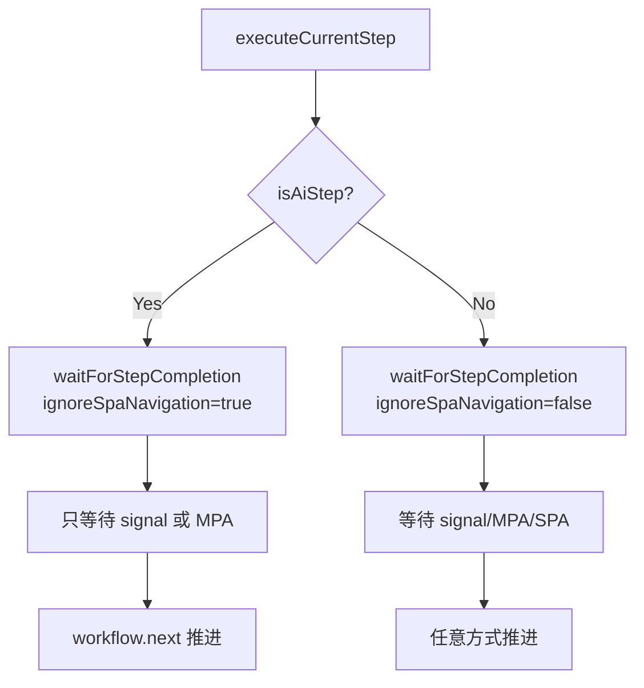

# AI Step SPA 导航修复

## 问题分析

当 AI step 执行时（如点击链接），GitLab 等 SPA 应用会触发 History API 更新。当前逻辑检测到 SPA 导航后会自动推进工作流，但此时 `pageAgent.execute()` 可能还未完成，导致 `workflow.next()` 与自动推进产生竞争，最终抛出 "Cancelled by new step execution" 错误。

## 解决方案

为 AI step 禁用 SPA 导航自动推进，只依赖脚本显式调用 `workflow.next()` 信号。




## 修改文件

### 1. [src/lib/types.ts](src/lib/types.ts)

在 `WorkflowStep` 接口添加 `isAiStep` 字段：

```typescript
export interface WorkflowStep {
  id: string;
  name: string;
  url?: string;
  waitId?: number;
  code: string;
  isAiStep?: boolean;  // 新增：标记是否为 AI step
}
```


### 2. [src/lib/parser.ts](src/lib/parser.ts)

在解析步骤时检测代码是否包含 `pageAgent.execute`：

```typescript
currentStep = {
  id: `step-${steps.length + 1}`,
  name,
  url,
  code: '',
  isAiStep: false  // 初始值
};

// 设置代码时检测
const stepCode = scriptCode.substring(lastIndex, match.index).trim();
currentStep.code = preamble ? `${preamble}\n\n${stepCode}` : stepCode;
currentStep.isAiStep = stepCode.includes('pageAgent.execute');
```


### 3. [src/background/index.ts](src/background/index.ts)

**3.1 修改 `waitForStepCompletion` 函数签名**添加 `ignoreSpaNavigation` 参数：

```typescript
function waitForStepCompletion(
  tabId: number, 
  executingUrl: string, 
  executingStepIndex: number,
  ignoreSpaNavigation: boolean = false  // 新增参数
): Promise<StepCompletionType>
```

**3.2 条件注册 SPA 导航监听器**

```typescript
// 只在非 AI step 时监听 SPA 导航
if (!ignoreSpaNavigation) {
  chrome.webNavigation.onHistoryStateUpdated.addListener(historyStateListener);
}

// cleanup 中也要条件清理
const cleanup = () => {
  chrome.webNavigation.onCommitted.removeListener(navigationCommitListener);
  if (!ignoreSpaNavigation) {
    chrome.webNavigation.onHistoryStateUpdated.removeListener(historyStateListener);
  }
  stepCompletionResolvers.delete(tabId);
};
```

**3.3 修改 `executeCurrentStep` 调用**

```typescript
const completionType = await waitForStepCompletion(
  tabId, 
  executingUrl, 
  executingStepIndex,
  step.isAiStep || false  // AI step 忽略 SPA 导航
);
```