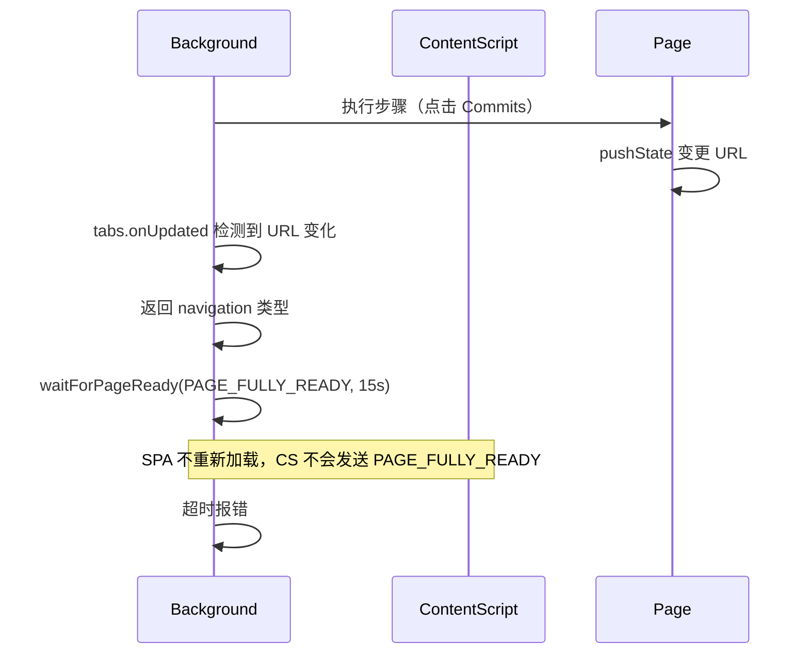
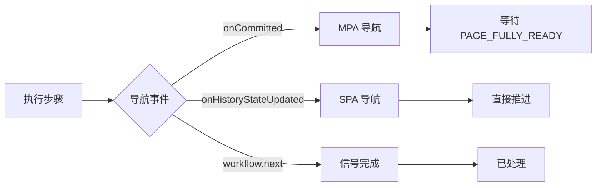

# SPA 导航超时修复

## 问题分析

当前流程：

1. `waitForStepCompletion` 监听 `chrome.tabs.onUpdated` 检测 URL 变化
2. URL 变化后返回 `'navigation'` 类型
3. `executeCurrentStep` 收到 `navigation` 后调用 `waitForPageReady(..., 15000)` 等待 `PAGE_FULLY_READY`
4. **问题**：SPA 路由变化不会重新加载页面，content script 不会重新发送 `PAGE_FULLY_READY`，导致 15 秒超时



## 解决方案

使用 Chrome webNavigation API 的两个事件精确区分导航类型（无需延时判断）：

- **`webNavigation.onCommitted`**：只在 MPA（真正的页面加载）时触发 → 需要等待 `PAGE_FULLY_READY`
- **`webNavigation.onHistoryStateUpdated`**：只在 SPA（pushState/replaceState）时触发 → 直接推进



## 修改文件

[src/background/index.ts](src/background/index.ts)

### 1. 修改 `waitForStepCompletion` 函数

返回更细粒度的导航类型：`'signal' | 'mpa_navigation' | 'spa_navigation'`核心改动：用 `webNavigation.onHistoryStateUpdated` 替代 `tabs.onUpdated` 来检测 SPA 导航。

```typescript
function waitForStepCompletion(
  tabId: number, 
  executingUrl: string, 
  executingStepIndex: number
): Promise<'signal' | 'mpa_navigation' | 'spa_navigation'> {
  // 清理旧的 resolver
  const existing = stepCompletionResolvers.get(tabId);
  if (existing) {
    existing.cleanup();
    existing.reject('Cancelled by new step execution');
  }

  return new Promise((resolve, reject) => {
    let resolved = false;
    
    const safeResolve = (type: 'signal' | 'mpa_navigation' | 'spa_navigation') => {
      if (!resolved) {
        resolved = true;
        cleanup();
        resolve(type);
      }
    };
    
    // 监听 MPA 导航（完整页面加载）
    const navigationCommitListener = (details: chrome.webNavigation.WebNavigationTransitionCallbackDetails) => {
      if (details.tabId === tabId && details.frameId === 0 && details.url !== executingUrl) {
        console.log(`[Pilot Engine] MPA navigation detected: ${executingUrl} -> ${details.url}`);
        safeResolve('mpa_navigation');
      }
    };
    
    // 监听 SPA 路由变化（History API: pushState/replaceState）
    const historyStateListener = (details: chrome.webNavigation.WebNavigationTransitionCallbackDetails) => {
      if (details.tabId === tabId && details.frameId === 0 && details.url !== executingUrl) {
        console.log(`[Pilot Engine] SPA navigation detected: ${executingUrl} -> ${details.url}`);
        safeResolve('spa_navigation');
      }
    };
    
    chrome.webNavigation.onCommitted.addListener(navigationCommitListener);
    chrome.webNavigation.onHistoryStateUpdated.addListener(historyStateListener);
    
    const cleanup = () => {
      chrome.webNavigation.onCommitted.removeListener(navigationCommitListener);
      chrome.webNavigation.onHistoryStateUpdated.removeListener(historyStateListener);
      stepCompletionResolvers.delete(tabId);
    };
    
    stepCompletionResolvers.set(tabId, {
      resolve: (type) => safeResolve(type as any),
      reject,
      cleanup,
      executingStepIndex
    });
    
    console.log(`[Pilot Engine] Waiting for step completion: signal, mpa_navigation, or spa_navigation`);
  });
}
```


### 2. 修改 `executeCurrentStep` 的完成处理逻辑

```typescript
if (completionType === 'mpa_navigation') {
  // MPA 导航：等待新页面就绪后推进
  console.log(`[Pilot Engine] MPA navigation detected, waiting for new page ready...`);
  await waitForPageReady(tabId, ['PAGE_FULLY_READY'], 15000);
  console.log(`[Pilot Engine] New page ready, auto-advancing workflow`);
  
  const latestWorkflow = workflows.get(tabId);
  if (latestWorkflow && latestWorkflow.currentStepIndex === executingStepIndex) {
    advanceWorkflow(tabId);
  }
} else if (completionType === 'spa_navigation') {
  // SPA 导航：页面未重新加载，直接推进
  console.log(`[Pilot Engine] SPA navigation completed, advancing workflow`);
  
  const latestWorkflow = workflows.get(tabId);
  if (latestWorkflow && latestWorkflow.currentStepIndex === executingStepIndex) {
    advanceWorkflow(tabId);
  }
} else {
  // 'signal': workflow.next/finish 已经调用了 advanceWorkflow
  console.log(`[Pilot Engine] Step completed by signal`);
}
```


## 方案优势

- **零延时判断**：直接使用 Chrome 事件区分导航类型，不依赖超时推断
- **确定性强**：`onCommitted` 和 `onHistoryStateUpdated` 是互斥的，不存在误判