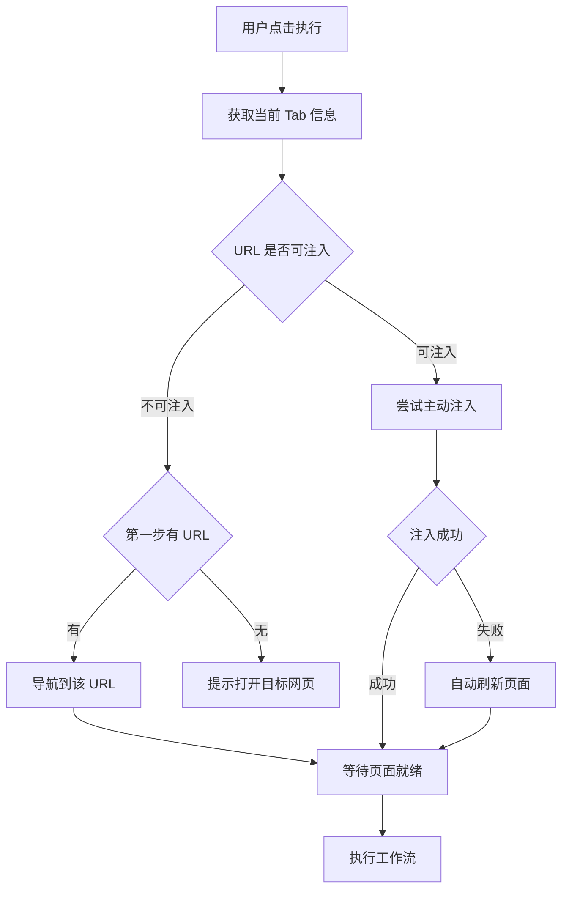

# 工作流启动体验优化

## 背景分析

当前问题：在新标签页（`chrome://newtab`）或其他受保护页面上启动工作流时，`waitForPageReady` 会等待 15 秒后超时失败，用户体验差。

## 核心逻辑流程




## 实现细节

### 1. 添加 URL 检测工具函数

在 [src/background/index.ts](src/background/index.ts) 顶部添加：

```typescript
function isInjectablePage(url: string | undefined): boolean {
  if (!url) return false;
  const blockedPrefixes = [
    'chrome://',
    'chrome-extension://',
    'edge://',
    'about:',
    'devtools://',
    'view-source:',
  ];
  return !blockedPrefixes.some(prefix => url.startsWith(prefix));
}
```


### 2. 添加智能注入函数（含自动刷新兜底）

在 [src/background/index.ts](src/background/index.ts) 中添加：

```typescript
async function ensureContentScriptReady(tabId: number): Promise<void> {
  // 先尝试 ping content script，检查是否已注入
  try {
    await chrome.tabs.sendMessage(tabId, { type: 'PING' });
    console.log('[Pilot Engine] Content script already active');
    return; // 已注入且响应，直接返回
  } catch {
    // 未响应，需要注入
  }

  // 尝试主动注入
  console.log('[Pilot Engine] Attempting to inject content script...');
  try {
    await chrome.scripting.executeScript({
      target: { tabId },
      files: ['assets/index.ts-CII22Rra.js'],
    });
    console.log('[Pilot Engine] Content script injected successfully');
    return;
  } catch (injectError) {
    console.warn('[Pilot Engine] Injection failed, falling back to reload:', injectError);
  }

  // 注入失败，自动刷新页面（manifest 配置了 run_at: document_start，刷新后会自动注入）
  console.log('[Pilot Engine] Reloading page to ensure content script injection...');
  await chrome.tabs.reload(tabId);
  // 刷新后 waitForPageReady 会等待 content script 就绪
}
```


### 3. 修改 START_WORKFLOW 处理逻辑

修改 [src/background/index.ts](src/background/index.ts) 第 461-482 行：

```typescript
} else if (request.type === 'START_WORKFLOW') {
  const { steps, tabId } = request.payload;
  
  (async () => {
    try {
      const tab = await chrome.tabs.get(tabId);
      const currentUrl = tab.url;
      
      if (!isInjectablePage(currentUrl)) {
        // 当前页面不可注入（chrome://, about: 等）
        const firstStepUrl = steps[0]?.url;
        
        if (firstStepUrl && isInjectablePage(firstStepUrl)) {
          console.log(`[Pilot Engine] Current page not injectable, navigating to: ${firstStepUrl}`);
          await chrome.tabs.update(tabId, { url: firstStepUrl });
          await waitForPageReady(tabId, ['PAGE_FULLY_READY'], 15000);
        } else {
          throw new Error('当前页面无法执行脚本，请先打开目标网页');
        }
      } else {
        // 可注入页面：确保 content script 就绪（注入或刷新）
        await ensureContentScriptReady(tabId);
        chrome.tabs.sendMessage(tabId, { type: 'RESET_AGENT' }).catch(() => {});
        await waitForPageReady(tabId, ['PAGE_FULLY_READY'], 15000);
      }
      
      startWorkflow(steps, tabId);
    } catch (err) {
      console.error('[Pilot Engine] Failed to prepare workflow:', err);
      const errorMsg = `准备执行失败: ${err instanceof Error ? err.message : String(err)}`;
      notifyWorkflowStatus(tabId, 'failed', errorMsg);
    }
  })();
}
```


### 4. 添加 PING 消息处理

在 [src/content/index.ts](src/content/index.ts) 的消息监听器中添加：

```typescript
chrome.runtime.onMessage.addListener((request, _sender, sendResponse) => {
  if (request.type === 'PING') {
    sendResponse({ pong: true });
    return;
  }
  // ... 其他处理
});
```


### 5. 可选：简化前端检测逻辑

在 [src/components/AgentTab.tsx](src/components/AgentTab.tsx) 中可以移除第 306-309 行的检测，因为后台已经能智能处理：

```typescript
// 移除或简化这段，让后台统一处理
if (tab.url?.startsWith('chrome://') || tab.url?.startsWith('chrome-extension://')) {
  // 不再直接 alert，而是让后台处理
  // 如果第一步有 URL 会自动导航，否则后台会返回错误
}
```


## 文件修改清单