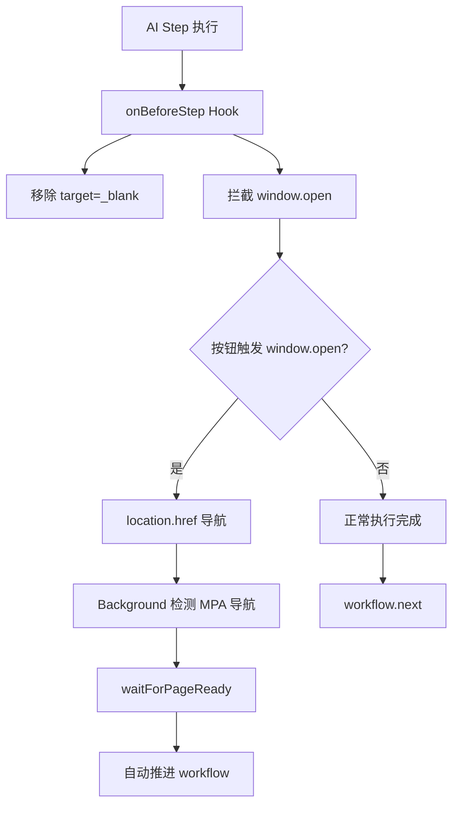

# 拦截 AI Step 执行中的 window.open 新标签页

## 问题分析

当前 AI step 执行过程中，如果按钮的 JS 代码调用 `window.open()` 打开新标签页：

1. 浏览器可能拦截弹窗
2. PageAgent 判断页面没跳转，不知道该继续执行

## 解决方案

在 [src/content/main-world.ts](src/content/main-world.ts) 的 `onBeforeStep` hook 中拦截 `window.open`，将新标签页打开行为转换为当前页面导航。

### 实现逻辑

```javascript
// 在 PageAgent 的 onBeforeStep 中
onBeforeStep: async function() {
  // 1. 已有：移除 target="_blank"
  // 2. 新增：拦截 window.open
  if (!(window as any).__pilotOpenIntercepted) {
    const originalOpen = window.open;
    (window as any).__pilotOriginalOpen = originalOpen;
    (window as any).__pilotOpenIntercepted = true;
    
    window.open = function(url, target, features) {
      if (url) {
        console.log('[Pilot] Intercepted window.open, navigating in current page:', url);
        location.href = url.toString();
      }
      return null;
    };
  }
}
```


### 工作流程




### 已有支持

Background 脚本已有 MPA 导航检测逻辑（第 875-887 行），当页面因 `location.href` 跳转时，会自动等待新页面就绪并推进工作流，无需额外修改。